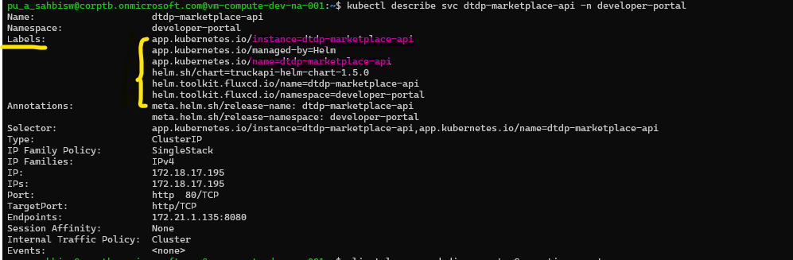
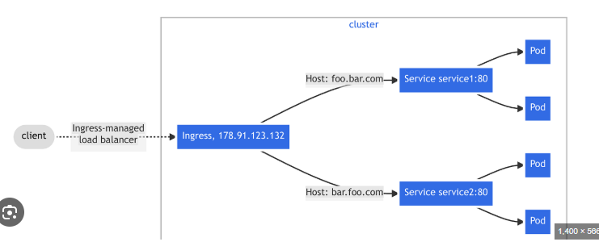
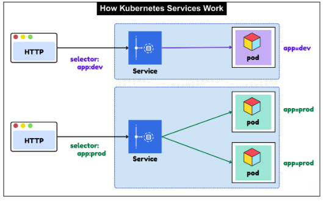
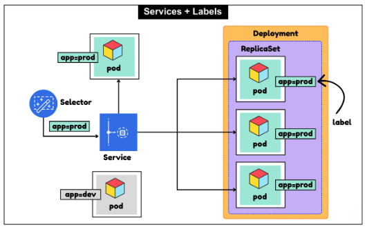
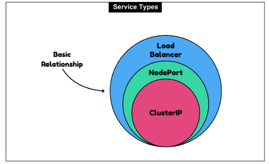

### Kubernetes - ClusterIP vs NodePort vs LoadBalancer
- Pods in Kubernetes are ephemeral. They come and go. When a pod dies and is replaced, it gets a `new IP address`. 
- If your frontend service was connecting directly to a backend pod's IP, that connection would break every time the backend pod restarted. This is the problem Kubernetes Services solve.
- A Service is a stable network abstraction that sits in front of a group of pods and provides a` consistent endpoint that never changes`, regardless of how often the pods behind it are replaced. 
- The Service uses a `label selector` to determine which pods belong to it. When a pod with a matching label starts, the Service automatically includes it in its backend pool. When that pod dies, the Service removes it. Your clients never need to know about individual pod IPs.

- A Kubernetes Service is an abstraction that defines a logical set of pods and a policy by which to access them. It provides a stable IP address and DNS name for a set of pods, regardless of their lifecycle. 
- This way,` your frontend can connect to the Service's IP or DNS name`, and Kubernetes will route the traffic to the appropriate backend pods, even if they restart or scale up/down.
- There are different types of Services in Kubernetes, each with its own use case:
  - 1.ClusterIP: 
    - This is the default type. It exposes the Service on a cluster-internal IP. 
    - This means the Service is only accessible from within the cluster. 
    - It's useful for internal communication between services (e.g., frontend to backend).
  - 2.NodePort: 
    - This type exposes the Service on a static port on each node's IP. 
    - This means the `Service can be accessed from outside` the cluster using <NodeIP>:<NodePort>. 
    - It's useful for development or when you want to expose a service without using a cloud provider's load balancer.
  - 3.LoadBalancer: 
    - This type creates an external load balancer (if supported by the cloud provider) and assigns a fixed, external IP to the Service. 
    - This is the most common way to expose a service to the internet in production environments. 
    - It provides a single IP address that clients can use to access the service, and the load balancer will distribute traffic to the backend pods.
  - 4.Ingress: 
    - This is not a Service type, but rather a separate resource that manages external access to services in a cluster, typically HTTP. 
    - It provides **features** like `URL routing`, `SSL termination`, and `load balancing`. 
    - Ingress controllers (like Nginx) implement the Ingress resource and route traffic to the appropriate services `based on rules defined` in the Ingress resource.
  - 5.Headless Service: 
    - This type of Service does not allocate a cluster IP. Instead, it returns the IPs of the individual pods directly. 
    - This is useful for stateful applications where you want to connect to specific pods (e.g., `databases`).
  - 6.ExternalName: 
    - This type maps a `Service to a DNS name`. It allows you to access an external service (outside the cluster) using a Kubernetes Service abstraction. 
    - The Service will resolve to the specified DNS name when accessed.
  - 7.Nginx/Ingress: `IMP`
    - Acts as the `single entry point` for traffic entering your `cluster`.
    - It performs tasks like load balancing, SSL/TLS termination, and traffic filtering before requests hit your microservices.
    - This is a popular Ingress controller that can be used to manage external access to services in a Kubernetes cluster. 
    - It provides features like `URL routing`, `SSL termination`, and `load balancing`.
    - This is also called the `reverse proxy pattern`, where the Nginx server acts as a single entry point for all incoming traffic and routes it to the appropriate backend services based on the defined rules.
    - Here Backend service won't be exposed to the internet directly. It will only be accessible through the Nginx server, which adds an extra layer of security and control over the traffic flow.
    - You can define Ingress resources to specify how traffic should be routed to your services based on hostnames and paths.
    

- Each of these Service types serves a different purpose, and the choice depends on your specific use case and environment. 
- For internal communication between services, ClusterIP is usually sufficient. For **exposing services to the internet**, `LoadBalancer` or `Ingress` is typically used.
- In summary, _**Kubernetes Services provide a stable endpoint for accessing a set of pods, abstracting away the dynamic nature of pod IPs**_. The different Service types allow you to control how your services are exposed and accessed, both internally and externally.
- In **production environments**, it's common to use `ClusterIP` for internal services and `LoadBalancer` or `Ingress` for external access. 
- This allows you to `maintain a clean separation between internal and external traffic` while ensuring that your services are resilient to pod restarts and scaling events.

## How Kubernetes Services Work
- When you create a Service in Kubernetes, it automatically creates a stable IP address and DNS name for that Service.
- The **label selector** is the binding mechanism between a Service and its pods. You define the Service with a selector, and every pod carrying that label becomes a backend endpoint for the Service.
- A Service with `selector: app:dev` routes traffic to only the pods labelled app=dev. A Service with `selector: app:prod` routes traffic to all pods labelled app=prod, which in this case is two pods.
- `IMP` - A Service load balances across all matching pods automatically. When you scale your Deployment from two to ten pods, the Service starts routing to all ten without any configuration change.
- When a pod fails its health check and is replaced, the new pod with the same labels is picked up by the Service automatically.

- This decoupling between Service definition and pod identity is what makes Kubernetes networking resilient. The Service is the stable thing. Pods are the ephemeral things. The selector is the contract between them.
- The `label selector is also how the Service knows when to add or remove endpoints.` When a new pod starts with a matching label and passes its readiness probe, the endpoints controller adds it to the Service's endpoint list.
- When a pod is deleted or fails its readiness probe, it is removed from the endpoint list immediately. Clients hitting the Service never route to an unhealthy pod.

## The Three Service Types
- Kubernetes has three main Service types and they are not independent options. They build on each other. Each outer type includes all the capabilities of the inner type.

- **ClusterIP** is the foundation. It gives your Service a virtual IP address that is only reachable from inside the cluster.
- **NodePort** builds on top of ClusterIP by additionally opening a port on every node in the cluster, making the Service reachable from outside.
- **LoadBalancer** builds on top of NodePort by additionally provisioning a cloud load balancer in front of those node ports, giving you a single stable external IP.
