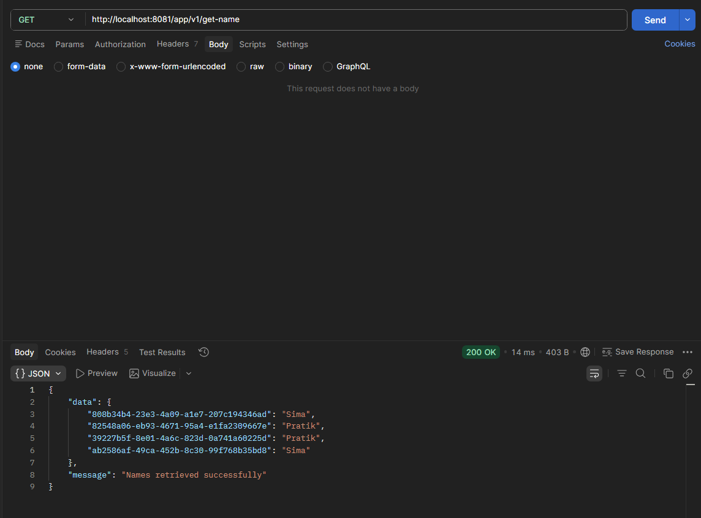

# Spring Boot App

### Spring Boot Flow Diagram

---

> - MyFirstController → MyFirstService → MyConstant(Insert and Fetch Data) - No Database Use Here.
> - MyDataController → MyDataService → MyDataRepository → Database(Insert and Fetch Data).

- The real data has been stored inside the MyConstant class for the simplicity of the application, but in real world application, we will be using a database to store the data and fetch it from the database.
- The MyDataController is responsible for handling the HTTP requests related to data operations, such as fetching data from the database or inserting data into the database. 
- It interacts with the MyDataService, which contains the business logic for data manipulation, and the MyDataRepository, which is responsible for interacting with the database to perform CRUD operations.

#### GET : Endpoint
- http://localhost:8081/app/v1/get-name

~~~ curl
curl --location 'localhost:8081/app/v1/get-name'
~~~
- Response:
~~~ json
{
  "data": {
    "808b34b4-23e3-4a09-a1e7-207c194346ad": "Sima",
    "82548a06-eb93-4671-95a4-e1fa2309667e": "Pratik"
  },
  "message": "Names retrieved successfully"
}
~~~

#### POST : Endpoint
- http://localhost:8081/app/v1/add-name
- Body:

~~~ json
{
    "name": "Sima"
}
~~~

~~~ curl
curl --location 'http://localhost:8081/app/v1/add-name' \
--header 'Content-Type: application/json' \
--data '{
    "name": "Sima"
}'
~~~

### Build and Deploy :

---

- Build the project using Maven.

~~~ bash
mvn clean install
~~~
- Once Build Success.
- Yuu could see the deployment jar available in the target folder `/app-base-path/target/peer-study-0.0.1-dev.jar`.
- Run the jar file, this is the deployment file and also called the `production ready` file.
- This is a Spring Boot application, so you can run the jar file using the below command.

~~~ bash
java -jar peer-study-0.0.1-dev.jar
~~~
- It runs with the default port provided by the application (inside the `application.yaml`).
- incase you need to change the port, then **EITHER** you can change it inside the `application.yaml` file **OR** 
   provide the port number as a command line argument while running the jar file.
- For example, to run the application on port 8082, you can use the following command:

~~~ bash
java -jar peer-study-0.0.1-dev.jar server.port=8082
~~~
- This is going to override the default port provided in the `application.yaml` file and run the application on port 8082.

### Get metrics with Prometheus.

---

- All the Metrics available in the application can be accessed using `actuator` endpoints.
- Actuator is a Spring Boot module that provides `production-ready` features to help you monitor and manage your application. 
- `Production-Ready` means, you can access these endpoints with any credential from any ENVIRONMENT (dev, test, production).
- It includes various endpoints that expose information about the application's health, metrics, and other useful data.

~~~ xml
<dependency>
    <groupId>org.springframework.boot</groupId>
    <artifactId>spring-boot-starter-actuator</artifactId>
</dependency>
~~~
- Once you added this dependency and enabled it through the `application.yml` file 

~~~ yaml
management:
  endpoints:
    web:
      exposure:
        include: "*"
~~~
- Now all the default actuator endpoints will be available on the base path `http://localhost:8081/actuator`.

- For Prometheus metrics, we need to add the `micrometer` dependency.
- Micrometer is a metrics collection library that provides a simple facade over the instrumentation clients for various monitoring systems, including Prometheus.
- To add the Micrometer Prometheus registry to your Spring Boot application, you can include the following dependency in your `pom.xml` file:
~~~ xml
<dependency>
	<groupId>io.micrometer</groupId>
	<artifactId>micrometer-registry-prometheus</artifactId>
</dependency>
~~~

- Once the application is running, you can access the metrics endpoint to see the application metrics in Prometheus format.
- You can access the metrics endpoint at `http://localhost:8081/actuator/prometheus` to see the application metrics in Prometheus format.
- The metrics endpoint will provide various metrics about the application, such as memory usage, CPU usage and other performance-related metrics that can be used for monitoring and troubleshooting the application.
- You can also integrate this metrics endpoint with a monitoring tool like Prometheus to visualize and analyze the metrics over time.
- To integrate with Prometheus, you can add the following configuration to your `application.yaml` file:
~~~ yaml
management:
  endpoints:
    web:
      exposure:
        include: prometheus
  endpoint:
    prometheus:
      enabled: true
~~~
- This configuration will enable the Prometheus endpoint and make it available at `http://localhost:8081/actuator/prometheus`.
- You can then configure Prometheus to scrape this endpoint at regular intervals to collect the metrics data for monitoring and analysis.
- For example, you can add the following configuration to your Prometheus configuration file (`prometheus.yml`): - **WILL TALK LATER** 

~~~ yaml
scrape_configs:
  - job_name: 'spring-boot-app'
    static_configs:
      - targets: ['localhost:8081']
~~~

- This configuration tells Prometheus to scrape the metrics from the Spring Boot application running on `localhost:8081` at regular intervals, allowing you to monitor the application's performance and health over time.
- You can then use Prometheus's query language (PromQL) to create custom queries and visualizations based on the collected metrics data, helping you gain insights into the application's behavior and performance.
- Overall, integrating Prometheus with your Spring Boot application using Micrometer allows you to effectively monitor and analyze the application's performance and health, enabling you to proactively identify and address any issues that may arise.
- In summary, to get metrics with Prometheus in a Spring Boot application, you need to add the `spring-boot-starter-actuator` and `micrometer-registry-prometheus` dependencies, enable the actuator endpoints, and configure Prometheus to scrape the metrics endpoint. This setup allows you to monitor and analyze your application's performance effectively.
- You can also create custom metrics using Micrometer by defining your own `MeterRegistry` and registering custom metrics with it. This allows you to track specific application metrics that are relevant to your use case, providing deeper insights into the application's behavior and performance.

### Add Dockerfile : Build Image : Run Container : Push to Docker Hub : Pull from Docker Hub : Run Container from Docker Hub

---

- A Dockerfile is a text file that contains instructions for building a Docker image. It specifies the base image, the application code, dependencies, and any necessary configurations to create a containerized version of your application.
- It is just `Blueprint` of Docker image, and it allows you to automate the process of creating a Docker image for your application, making it easier to deploy and run your application in a consistent environment across different platforms.
- To create a Dockerfile for your Spring Boot application, you can use the following example as a starting point:

~~~ dockerfile
# Use an official OpenJDK runtime as a parent image, check the Image version with the Java version you are using in your application and configure the same in the Dockerfile.
# This has pulled the OpenJDK 25 image from the Docker Hub (https://hub.docker.com/_/openjdk/tags), which is a lightweight version of the JDK that is suitable for running Java applications in a containerized environment.
FROM openjdk:25-jdk-slim
# Set the working directory in the container (A folder inside the container where the application will be stored).
WORKDIR /app
# Copy the jar file from the target directory to the container
COPY target/peer-study-0.0.1-dev.jar app.jar
# Expose the port that the application will run on
EXPOSE 8081
# Run the jar file when the container starts
ENTRYPOINT ["java", "-jar", "app.jar"]
~~~

- This `Dockerfile` uses the official OpenJDK <JAVA_VERSION> image as the base image, sets the working directory to `/app`, copies the built jar file into the container, exposes port 8081, and specifies the command to run the application when the container starts.
- To build the Docker image, you can use the following command in the terminal, **making sure you are in the directory where the Dockerfile is located:**

~~~ bash
docker build -t peer-study:0.0.1-dev .
docker build --progress=plain --no-cache -t peer-study:0.0.1-dev .
~~~

- Once added the `docker build` command, it will look up the `Dockerfile` and read the instructions from the Dockerfile, build the image according to those instructions.
- This command builds the Docker image and tags it as `peer-study:0.0.1-dev`. The `.` at the end specifies the build context, which is the current directory where the Dockerfile is located.

> NOTE : 
> - Image Name : `peer-study` and Tag : `0.0.1-dev`.
> - The image name is used to identify the image(application-name preferable), and the tag is used to specify a specific version of the image. In this case, `0.0.1-dev` indicates that this is a development version of the `peer-study` image.
> - tag creates the major role in the real world deployment, because it helps to identify the version of the image and manage different versions of the application effectively. 
> - It allows you to track changes, roll back to previous versions if needed, and ensure that you are using the correct version of the image in different environments (development, staging, production).
> - We need new tag every time(++1) when we make changes to the application and build a new image, this way we can keep track of the different versions of the image and manage them effectively.

- In every PULL REQUEST, just updates the tag `version` in pom.xml file, this way we can keep track of the different versions of the image and manage them effectively.

pom.xml file:
~~~ xml
	<groupId>spring-boot</groupId>
	<artifactId>peer-study</artifactId>
	<version>0.0.1-dev</version>
    
    Prefrable : 0.0.1-dev, 0.0.2-dev, 0.0.3-dev and so on for the development versions of the image.
~~~

build.gradle.kts file:
~~~ kotlin
group = "spring-boot"
version = "0.0.1-dev"
~~~

- Once the image is built successfully, you can run a container from the image using the following command:

~~~ bash
docker run -p <port-outside-container>:<port-inside-container> <image-name>:<tag>
docker run -p 8082:8081 peer-study:0.0.1-dev
# `-d` flag is used to run the container in detached mode, which means that the container will run in the background.
docker run -p 8082:8081 -d peer-study:0.0.1-dev
# This command will automatically map the port 8081 of the container to a random available port on the host machine, allowing you to access the application without specifying a specific port.
docker run -p 8081 -d peer-study:0.0.1-dev
~~~

- Looks this port command carefully, the first port number `(8082)` is the port on the host machine that you want to map to the second port number `(8081)`, which is the port that the application is running on inside the container.
- This means that when you access `http://localhost:8082` on your host machine, it will be forwarded to port 8081 inside the container where the application is running.
- `8082` port for outside and `8081` port for inside the container.
- Local System : `http://localhost:8082` → Go Inside the Container : `http://localhost:8081`.
- This command runs a container from the `peer-study:0.0.1-dev` image and maps port 8082 of the container to port 8081 on the host machine, allowing you to access the application.
- This is also called the `port mapping`, which allows you to access the application running inside the container from your host machine using the specified port.
- After running the container, you can access the application at `http://localhost:8082` and it will be forwarded to the application running inside the container on port 8081.
- `Port Forwarding` - Need to talk about this in class(1-0-1).
- To push the Docker image to Docker Hub, you first need to tag the image with your Docker Hub username and the repository name. For example, if your Docker Hub username is `yourusername` and you want to push to a repository named `peer-study`, you can tag the image as follows:

~~~ docker commands
docker images
docker ps
docker exec -it <container_id> sh
docker exec -it e475153a6ae8 sh
docker logs <container_id>
docker logs e475153a6ae8
docker stop <container_id>
docker stop e475153a6ae8
docker rm <container_id>
docker rm e475153a6ae8
docker rmi <image_id>
docker rmi 8b1c9e5f8a2c
docker rmi <image_name>:<tag>
docker rmi peer-study:0.0.1-dev
docker rmi yourusername/peer-study:0.0.1-dev
~~~

~~~ bash
docker login
docker login -u yourusername
docker login -u yourusername -p yourpassword
docker logout
docker tag peer-study:0.0.1-dev yourusername/peer-study:0.0.1-dev
~~~

- The `docker login` command is used to authenticate with Docker Hub using your Docker Hub credentials. This step is necessary before you can push images to your Docker Hub repository.
- The `docker tag` command is used to create a new tag for the existing image.
- In this case, it tags the `0.0.1-dev` image with the new name `yourusername/peer-study:0.0.1-dev`, which follows the convention of `username/repository:tag`.
- After tagging the image, you can push it to Docker Hub using the following command:
- Before pushing the image, make sure you have tagged it(line number 239-240) OR created a repository named `peer-study` in your Docker Hub account to which you want to push the image.

~~~ bash
docker tag local-image:tagname yourusername/new-repo:tagname
docker tag peer-study:0.0.1-dev rockysahoo/peer-study:0.0.1-dev
docker push yourusername/peer-study:0.0.1-dev
~~~

- This command pushes the tagged image to your Docker Hub repository, making it available for others to pull and use.
- To pull the Docker image from Docker Hub, you can use the following command:

~~~ bash
docker pull yourusername/peer-study:0.0.1-dev
~~~

- This command pulls the specified image from Docker Hub to your local machine, allowing you to run it as a container.
- Once the image is pulled, you can run a container from it using the same `docker run` command as before:

~~~ bash
docker run -p 8083:8081 yourusername/peer-study:0.0.1-dev
~~~

- This command runs a container from the pulled image and maps port 8083 of the container to port 8081 on the host machine, allowing you to access the application at `http://localhost:8083`.
- In summary, to add a Dockerfile, build an image, run a container, push to Docker Hub, pull from Docker Hub, and run a container from Docker Hub, you need to create a Dockerfile with the necessary instructions, 
  build the image using `docker build`, run the container using `docker run`, tag and push the image to Docker Hub using `docker tag` and `docker push`, pull the image using `docker pull`, and run a container from the pulled image using `docker run`. 
- This process allows you to containerize your application and share it easily through Docker Hub.
- Overall, using Docker allows you to create a consistent and portable environment for your application, making it easier to deploy and manage across different environments and platforms.

### Docker Compose : Build the app with docker-compose.yaml file : add database to application : database as the docker image (Postgres) : app container talks to postgres container.

---

- In addition to the basic Docker commands, you can also use Docker Compose to manage multi-container applications, allowing you to define and run multiple containers with a single command. This is particularly useful when your application has 
  dependencies on other services, such as databases or message brokers, that need to be run alongside your application container.
- To use Docker Compose, you need to create a `docker-compose.yml` file that defines the services and their configurations. For example, if your Spring Boot application depends on a PostgreSQL database, your `docker-compose.yml` file might look like this:
- The filename should be `docker-compose.yml` and it should be located in the root directory of your project, where your Dockerfile is also located.
- You can add the custom filename for the docker compose file, but the default name is `docker-compose.yml` and it is recommended to use the default name for better readability and convention.
- Remember adding the custom filename `peer-study-docker-compose.yml` for the docker compose file, you need to specify the filename while running the docker compose command, for example:  Look the line number 238.

~~~ yaml
version: '3'
services:
  app:
    image: yourusername/peer-study:0.0.1-dev
    ports:
      - "8082:8081" # Map port 8082 on the host to port 8081 in the container
    environment:
      SPRING_DATASOURCE_URL: jdbc:postgresql://db:5432/peer_study_db
      SPRING_DATASOURCE_USERNAME: postgres
      SPRING_DATASOURCE_PASSWORD: password
    depends_on:
      - db
  db:
    image: postgres:latest
    environment:
      POSTGRES_USER: postgres
      POSTGRES_PASSWORD: password
      POSTGRES_DB: peer_study_db
    ports:
      - "5432:5432" # Map port 5432(outside the container) on the host to port 5432(inside the container) in the container
~~~

- In this example, we have defined two services: `app`, which runs the Spring Boot application, and `db`, which runs a PostgreSQL database. The `app` service depends on the `db` service, ensuring that the database is started before the application. 
> VVIP NOTE: 
>  - The `depends_on` option in Docker Compose does not wait for the database to be fully ready before starting the application. To ensure that the application waits for the database to be ready, you can use a health check in the `db` service and 
>    configure the `app` service to wait for the database to be healthy before starting. This can be done using the `healthcheck` option in the `db` service and the `depends_on` option with a condition in the `app` service.
>  - Inside the Docker container, the communication between the **application and the database is done using the service name** defined in the `docker-compose` file. In this case, the application can connect to the database using the hostname `db`, 
>    which is the name of the database service defined in the Docker Compose file. This allows the application to communicate with the database container without needing to know its IP address, as Docker Compose handles the networking between the containers.

- You can then start both services using the following command:

~~~ bash
docker-compose up
docker-compose -f peer-study-docker-compose.yml up
~~~

- This command will start both the application and the database containers, allowing you to access the application at `http://localhost:8082` and the database at `localhost:5432`. 
- Using Docker Compose simplifies the management of multi-container applications and allows you to **easily scale and orchestrate your services** as needed. It also provides features such as environment variable management, volume mounting, and network configuration,
- Making it a powerful tool for developing and deploying complex applications with multiple dependencies. Overall, Docker Compose is an essential tool for managing multi-container applications and can greatly simplify the development and deployment process.
- Using Docker and Docker Compose allows you to create a consistent and portable environment for your application, making it easier to deploy and manage across different environments and platforms. 
- By containerizing your application and its dependencies, you can ensure that it runs consistently regardless of the underlying infrastructure, making it easier to develop, test, and deploy your application with confidence.
- In addition to the basic Docker commands and Docker Compose, you can also use `Docker Swarm or Kubernetes` for **orchestrating and managing your containerized applications at scale**. 
- These tools provide features such as **load balancing**, **service discovery**, and **automatic scaling**, allowing you to manage complex applications with ease. 
- By leveraging these orchestration tools, you can ensure high availability and reliability for your applications while simplifying the deployment and management process. 
- Overall, using Docker and its associated tools provides a powerful and flexible way to develop, deploy, and manage your applications in a modern cloud-native environment.
- Docker and its ecosystem of tools offers a comprehensive solution for containerizing, deploying, and managing applications. 
- Whether you're using basic Docker commands, Docker Compose for multi-container applications, or orchestration tools like Docker Swarm or Kubernetes, you can create a consistent and portable environment for your applications, making it easier to develop, test, and deploy with confidence. 
- By embracing containerization and orchestration, you can ensure that your applications are scalable, reliable, and easy to manage in today's dynamic cloud-native landscape.

### Databse configuration in APP : Fetch Data source details from External System OR Pass as Environment Variables Arguments

---

- In a Spring Boot application, you can configure the database connection details in the `application.properties` or `application.yaml` file. However, for better security and flexibility.
- it is recommended to fetch these details from an external system(`config-server`, `flux`) or pass them as environment variables.
- To fetch database connection details from an external system, you can use a configuration management tool like Spring Cloud Config or HashiCorp Vault. 
- These tools allow you to securely store and manage your configuration properties, including database credentials, and provide them to your application at runtime.
- Alternatively, you can pass the database connection details as environment variables when running your application. 
- This approach is particularly useful when deploying your application in a containerized environment like Docker, where you can easily set environment variables for your containers.
- To pass database connection details as environment variables, you can set the following environment variables in your Docker Compose file or when running the Docker container:

docker-compose.yml file:
~~~ yaml
services:
  app:
    environment:
      SPRING_DATASOURCE_URL: jdbc:postgresql://db:5432/peer_study_db
      SPRING_DATASOURCE_USERNAME: postgres
      SPRING_DATASOURCE_PASSWORD: password
~~~ 

- When running the Docker container:

~~~ bash
docker run -p 8081:8081 -e SPRING_DATASOURCE_URL=jdbc:postgresql://db:5432/peer_study_db -e SPRING_DATASOURCE_USERNAME=postgres -e SPRING_DATASOURCE_PASSWORD=password peer-study-app
docker run -p 8082:8081 -e SPRING_DATASOURCE_URL=jdbc:postgresql://db:5432/peer_study_db -e SPRING_DATASOURCE_USERNAME=postgres -e SPRING_DATASOURCE_PASSWORD=password yourusername/peer-study:0.0.1-dev
~~~

