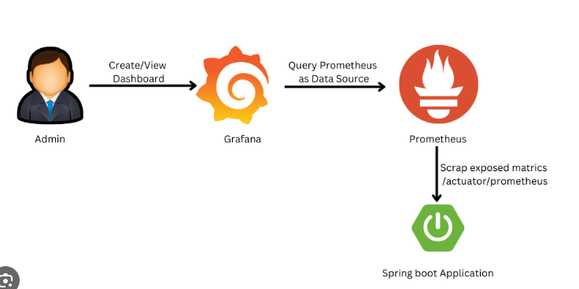
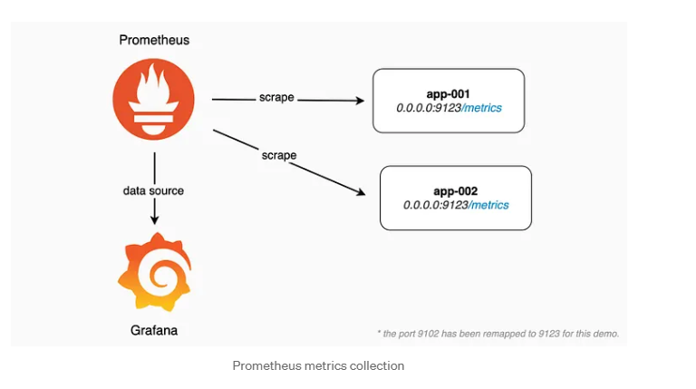
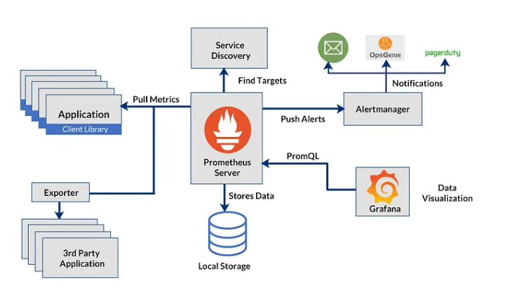
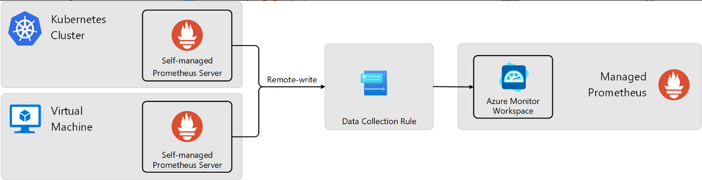
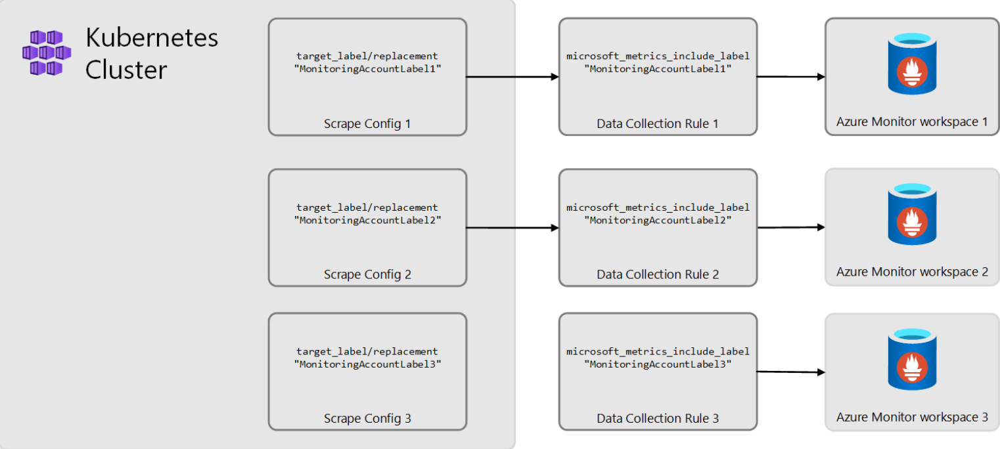
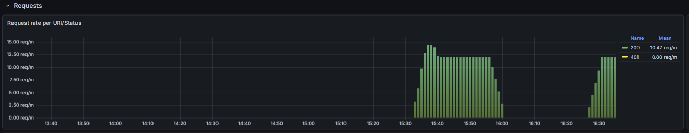

# Spring Boot App:


## Spring Boot Flow Diagram

> - MyFirstController → MyFirstService → MyConstant(Insert and Fetch Data) - No Database Use Here.
> - MyDataController → MyDataService → MyDataRepository → Database(Insert and Fetch Data).

- The real data has been stored inside the MyConstant class for the simplicity of the application, but in real world application, we will be using a database to store the data and fetch it from the database.
- The `MyDataController` is responsible for handling the HTTP requests related to data operations, such as fetching data from the database or inserting data into the database. 
- It interacts with the `MyDataService`, which contains the business logic for data manipulation, and the `MyDataRepository`, which is responsible for interacting with the database to perform CRUD operations.
- For SAMPLE Data insert Refer to `/testData` file, which contains the sample data and the endpoints to insert and fetch the data from the database.

### Build and Deploy :

---

- Build the project using Maven.

~~~ bash
mvn clean install
~~~
- Once Build Success.
- Yuu could see the deployment jar available in the target folder `/app-base-path/target/peer-study-0.0.1-dev.jar`.
- Run the jar file, this is the deployment file and also called the `production ready` file.
- This is a Spring Boot application, so you can run the jar file using the below command.

~~~ bash
java -jar peer-study-0.0.1-dev.jar
~~~
- It runs with the default port provided by the application (inside the `application.yaml`).
- incase you need to change the port, then **EITHER** you can change it inside the `application.yaml` file **OR** 
   provide the port number as a command line argument while running the jar file.
- For example, to run the application on port 8082, you can use the following command:

~~~ bash
java -jar peer-study-0.0.1-dev.jar server.port=8082
~~~
- This is going to override the default port provided in the `application.yaml` file and run the application on port 8082.

## Get metrics with Prometheus.

---

- All the Metrics available in the application can be accessed using `actuator` endpoints.
- Actuator is a Spring Boot module that provides `production-ready` features to help you monitor and manage your application. 
- `Production-Ready` means, you can access these endpoints with any credential from any ENVIRONMENT (dev, test, production).
- It includes various endpoints that expose information about the application's health, metrics, and other useful data.

~~~ xml
<dependency>
    <groupId>org.springframework.boot</groupId>
    <artifactId>spring-boot-starter-actuator</artifactId>
</dependency>
~~~
- Once you added this dependency and enabled it through the `application.yml` file 

~~~ yaml
management:
  endpoints:
    web:
      exposure:
        include: "*"
~~~
- Now all the default actuator endpoints will be available on the base path `http://localhost:8081/actuator`.

- For Prometheus metrics, we need to add the `micrometer` dependency.
- Micrometer is a metrics collection library that provides a simple facade over the instrumentation clients for various monitoring systems, including Prometheus.
- To add the Micrometer Prometheus registry to your Spring Boot application, you can include the following dependency in your `pom.xml` file:
~~~ xml
<dependency>
	<groupId>io.micrometer</groupId>
	<artifactId>micrometer-registry-prometheus</artifactId>
</dependency>
~~~

- Once the application is running, you can access the metrics endpoint to see the application metrics in Prometheus format.
- You can access the metrics endpoint at `http://localhost:8081/actuator/prometheus` to see the application metrics in Prometheus format.
- The metrics endpoint will provide various metrics about the application, such as memory usage, CPU usage and other performance-related metrics that can be used for monitoring and troubleshooting the application.
- You can also integrate this metrics endpoint with a monitoring tool like Prometheus to visualize and analyze the metrics over time.
- To integrate with Prometheus, you can add the following configuration to your `application.yaml` file:
~~~ yaml
management:
  endpoints:
    web:
      exposure:
        include: prometheus
  endpoint:
    prometheus:
      enabled: true
~~~
- This configuration will enable the Prometheus endpoint and make it available at `http://localhost:8081/actuator/prometheus`.
- You can then configure Prometheus to scrape this endpoint at regular intervals to collect the metrics data for monitoring and analysis.
- For example, you can add the following configuration to your Prometheus configuration file (`prometheus.yml`): - **WILL TALK LATER** 

~~~ yaml
scrape_configs:
  - job_name: 'spring-boot-app'
    static_configs:
      - targets: ['localhost:8081']
~~~

- This configuration tells Prometheus to scrape the metrics from the Spring Boot application running on `localhost:8081` at regular intervals, allowing you to monitor the application's performance and health over time.
- You can then use Prometheus's query language (PromQL) to create custom queries and visualizations based on the collected metrics data, helping you gain insights into the application's behavior and performance.
- Overall, integrating Prometheus with your Spring Boot application using Micrometer allows you to effectively monitor and analyze the application's performance and health, enabling you to proactively identify and address any issues that may arise.
- In summary, to get metrics with Prometheus in a Spring Boot application, you need to add the `spring-boot-starter-actuator` and `micrometer-registry-prometheus` dependencies, enable the actuator endpoints, and configure Prometheus to scrape the metrics endpoint. This setup allows you to monitor and analyze your application's performance effectively.
- You can also create custom metrics using Micrometer by defining your own `MeterRegistry` and registering custom metrics with it. This allows you to track specific application metrics that are relevant to your use case, providing deeper insights into the application's behavior and performance.

## Add Dockerfile - Build Image - Run Container - Push to Docker Hub - Pull from Docker Hub - Run Container from Docker Hub

---

- A Dockerfile is a text file that contains instructions for building a Docker image. It specifies the base image, the application code, dependencies, and any necessary configurations to create a containerized version of your application.
- It is just `Blueprint` of Docker image, and it allows you to automate the process of creating a Docker image for your application, making it easier to deploy and run your application in a consistent environment across different platforms.
- Docker `Container` is a `run time instance of a Docker Image` & It is `isolated environment` where your application runs. It is created from a Docker image and contains everything needed to run the application, including the code, runtime, libraries, and system tools.
- To create a Dockerfile for your Spring Boot application, you can use the following example as a starting point:

~~~ dockerfile
# Use an official OpenJDK runtime as a parent image, check the Image version with the Java version you are using in your application and configure the same in the Dockerfile.
# This has pulled the OpenJDK 25 image from the Docker Hub (https://hub.docker.com/_/openjdk/tags), which is a lightweight version of the JDK that is suitable for running Java applications in a containerized environment.
FROM openjdk:25-jdk-slim
# Set the working directory in the container (A folder inside the container where the application will be stored).
WORKDIR /app
# Copy the jar file from the target directory to the container
COPY target/peer-study-0.0.1-dev.jar app.jar
# Expose the port that the application will run on
EXPOSE 8081
# Run the jar file when the container starts
ENTRYPOINT ["java", "-jar", "app.jar"]
~~~

- This `Dockerfile` uses the official OpenJDK <JAVA_VERSION> image as the base image, sets the working directory to `/app`, copies the built jar file into the container, exposes port 8081, and specifies the command to run the application when the container starts.
- To build the Docker image, you can use the following command in the terminal, **making sure you are in the directory where the Dockerfile is located:**

~~~ bash
docker build -t peer-study:0.0.1-dev .
docker build --progress=plain --no-cache -t peer-study:0.0.1-dev .
~~~

- Once added the `docker build` command, it will look up the `Dockerfile` and read the instructions from the Dockerfile, build the image according to those instructions.
- This command builds the Docker image and tags it as `peer-study:0.0.1-dev`. The `.` at the end specifies the build context, which is the current directory where the Dockerfile is located.

> NOTE : 
> - Image Name : `peer-study` and Tag : `0.0.1-dev`.
> - The image name is used to identify the image(application-name preferable), and the tag is used to specify a specific version of the image. In this case, `0.0.1-dev` indicates that this is a development version of the `peer-study` image.
> - tag creates the major role in the real world deployment, because it helps to identify the version of the image and manage different versions of the application effectively. 
> - It allows you to track changes, roll back to previous versions if needed, and ensure that you are using the correct version of the image in different environments (development, staging, production).
> - We need new tag every time(++1) when we make changes to the application and build a new image, this way we can keep track of the different versions of the image and manage them effectively.

- In every PULL REQUEST, just updates the tag `version` in pom.xml file, this way we can keep track of the different versions of the image and manage them effectively.

pom.xml file:
~~~ xml
	<groupId>spring-boot</groupId>
	<artifactId>peer-study</artifactId>
	<version>0.0.1-dev</version>
    
    Prefrable : 0.0.1-dev, 0.0.2-dev, 0.0.3-dev and so on for the development versions of the image.
    TALK THIS PART ON CICD SESSION, HOW TO MANAGE THE VERSIONING OF THE IMAGE IN THE REAL WORLD SCENARIO WITH `GITHUB ACTIONS`.
~~~

build.gradle.kts file:
~~~ kotlin
group = "spring-boot"
version = "0.0.1-dev"
~~~

- Once the image is built successfully, you can run a container from the image using the following command:

~~~ bash
docker run -p <port-outside-container>:<port-inside-container> <image-name>:<tag>
docker run -p 8082:8081 peer-study:0.0.1-dev
# `-d` flag is used to run the container in detached mode, which means that the container will run in the background.
docker run -p 8082:8081 -d peer-study:0.0.1-dev
# This command will automatically map the port 8081 of the container to a random available port on the host machine, allowing you to access the application without specifying a specific port.
docker run -p 8081 -d peer-study:0.0.1-dev
~~~

- Looks this port command carefully, the first port number `(8082)` is the port on the host machine that you want to map to the second port number `(8081)`, which is the port that the application is running on inside the container.
- This means that when you access `http://localhost:8082` on your host machine, it will be forwarded to port 8081 inside the container where the application is running.
- `8082` port for outside and `8081` port for inside the container.
- Local System : `http://localhost:8082` → Go Inside the Container : `http://localhost:8081`.
- This command runs a container from the `peer-study:0.0.1-dev` image and maps port 8082 of the container to port 8081 on the host machine, allowing you to access the application.
- This is also called the `port mapping`, which allows you to access the application running inside the container from your host machine using the specified port.
- After running the container, you can access the application at `http://localhost:8082` and it will be forwarded to the application running inside the container on port 8081.
- `Port Forwarding` - Need to talk about this in class(1-0-1).
- To push the Docker image to Docker Hub, you first need to tag the image with your Docker Hub username and the repository name. For example, if your Docker Hub username is `yourusername` and you want to push to a repository named `peer-study`, you can tag the image as follows:

~~~ docker commands
docker images
docker ps
docker exec -it <container_id> sh
docker exec -it e475153a6ae8 sh
docker logs <container_id>
docker logs e475153a6ae8
docker stop <container_id>
docker stop e475153a6ae8
docker rm <container_id>
docker rm e475153a6ae8
docker rmi <image_id>
docker rmi 8b1c9e5f8a2c
docker rmi <image_name>:<tag>
docker rmi peer-study:0.0.1-dev
docker rmi yourusername/peer-study:0.0.1-dev
~~~

~~~ bash
docker login
docker login -u yourusername
docker login -u yourusername -p yourpassword
docker logout
docker tag peer-study:0.0.1-dev yourusername/peer-study:0.0.1-dev
~~~

- The `docker login` command is used to authenticate with Docker Hub using your Docker Hub credentials. This step is necessary before you can push images to your Docker Hub repository.
- The `docker tag` command is used to create a new tag for the existing image.
- In this case, it tags the `0.0.1-dev` image with the new name `yourusername/peer-study:0.0.1-dev`, which follows the convention of `username/repository:tag`.
- After tagging the image, you can push it to Docker Hub using the following command:
- Before pushing the image, make sure you have tagged it(line number 239-240) OR created a repository named `peer-study` in your Docker Hub account to which you want to push the image.

~~~ bash
docker tag local-image:tagname yourusername/new-repo:tagname
docker tag peer-study:0.0.1-dev rockysahoo/peer-study:0.0.1-dev
docker push yourusername/peer-study:0.0.1-dev
~~~

- This command pushes the tagged image to your Docker Hub repository, making it available for others to pull and use.
- To pull the Docker image from Docker Hub, you can use the following command:

~~~ bash
docker pull yourusername/peer-study:0.0.1-dev
~~~

- This command pulls the specified image from Docker Hub to your local machine, allowing you to run it as a container.
- Once the image is pulled, you can run a container from it using the same `docker run` command as before:

~~~ bash
docker run -p 8083:8081 yourusername/peer-study:0.0.1-dev
~~~

- This command runs a container from the pulled image and maps port 8083 of the container to port 8081 on the host machine, allowing you to access the application at `http://localhost:8083`.
- In summary, to add a Dockerfile, build an image, run a container, push to Docker Hub, pull from Docker Hub, and run a container from Docker Hub, you need to create a Dockerfile with the necessary instructions, 
  build the image using `docker build`, run the container using `docker run`, tag and push the image to Docker Hub using `docker tag` and `docker push`, pull the image using `docker pull`, and run a container from the pulled image using `docker run`. 
- This process allows you to containerize your application and share it easily through Docker Hub.
- Overall, using Docker allows you to create a consistent and portable environment for your application, making it easier to deploy and manage across different environments and platforms.

## Docker Compose - Build the app with docker-compose.yaml file - add database to application - database as the docker image (Postgres) - app container talks to postgres container.

---

- In addition to the basic Docker commands, you can also use Docker Compose to manage multi-container applications, allowing you to define and run multiple containers with a single command. 
- This is particularly useful when your application has dependencies on other services, such as databases or message brokers, that need to be run alongside your application container.
- To use Docker Compose, you need to create a `docker-compose.yml` file that defines the services and their configurations. 
- For example, if your Spring Boot application depends on a PostgreSQL database, your `docker-compose.yml` file might look like below file.
- The filename should be `docker-compose.yml` and it should be located in the root directory of your project, where your Dockerfile is also located.
- You can add the custom filename for the docker compose file, but the default name is `docker-compose.yml` and it is recommended to use the default name for better readability and convention.
- Remember adding the custom filename `peer-study-docker-compose.yml` for the docker compose file, you need to specify the filename while running the docker compose command.

> IMP NOTE : USE CASE OF DOCKER COMPOSE - WHEN YOUR APPLICATION HAS DEPENDENCIES ON OTHER SERVICES, SUCH AS DATABASES OR MESSAGE BROKERS, THAT NEED TO BE RUN ALONGSIDE YOUR APPLICATION CONTAINER.
>   - So the application running in your local, and you've already installed the database in your local machine, and configured the data-sources inside the `application.yaml`.
>   - Once application starts, it will connect to the database running in your local machine and perform the operations.
>   - But when you run the application in a docker container, it will not be able to connect to the database running in your local machine, because the application is running inside the container and it does not have access to the local machine's network.
>   - Docker used different networking for the containers, and the application container will not be able to access the database running in your local machine, which is outside the container.
>   - To solve this issue, you can use Docker Compose to define both the application and the database as services, and configure them to communicate with each other using Docker's networking features. 
>   - This way, the application container can connect to the database container using the service name defined in the Docker Compose file, allowing them to work together seamlessly.
>   - In the `docker-compose.yml` file, you can define the application service and the database service, and specify the necessary environment variables for the database connection.
>   - The application service can then use the service name of the database service to connect to it, allowing the application to interact with the database as if they were running on the same machine.
>   - This approach allows you to easily manage and orchestrate your application and its dependencies, making it easier to develop, test, and deploy your application in a consistent environment.

- Access database running in container using `localhost` and the port number specified in the `docker-compose.yml` file, which is mapped to the database container's port.
- For example, if you have mapped port 5432 of the database container to port 5432 on the host machine, `EITHER` you can access the database using `localhost:5432` from your application running in another container or from your local machine.
- `OR` you can also access the database using docker container name/id.
~~~ bash
docker exec -it cc79eba15049 psql -U postgres -d peer_study_db

postgres-# \dt
Did not find any tables.
postgres-#
~~~

docker-compose.yml file:
~~~ yaml
version: '3'
services:
  app:
    image: yourusername/peer-study:0.0.1-dev
    ports:
      - "8082:8081" # Map port 8082 on the host to port 8081 in the container
    environment:
      SPRING_DATASOURCE_URL: jdbc:postgresql://db:5432/peer_study_db
      SPRING_DATASOURCE_USERNAME: postgres
      SPRING_DATASOURCE_PASSWORD: password
    depends_on:
      - db
  db:
    image: postgres:latest
    environment:
      POSTGRES_USER: postgres
      POSTGRES_PASSWORD: password
      POSTGRES_DB: peer_study_db
    ports:
      - "5432:5432" # Map port 5432(outside the container) on the host to port 5432(inside the container) in the container
~~~

- In this example, we have defined two services: `app`, which runs the Spring Boot application, and `db`, which runs a PostgreSQL database. The `app` service depends on the `db` service, ensuring that the database is started before the application. 
> IMP NOTE: 
>  - The `depends_on` option in Docker Compose does not wait for the database to be fully ready before starting the application. To ensure that the application waits for the database to be ready, you can use a health check in the `db` service and 
>    configure the `app` service to wait for the database to be healthy before starting. This can be done using the `healthcheck` option in the `db` service and the `depends_on` option with a condition in the `app` service.
>  - Inside the Docker container, the communication between the **application and the database is done using the service name** defined in the `docker-compose` file. In this case, the application can connect to the database using the hostname `db`, 
>    which is the name of the database service defined in the Docker Compose file. This allows the application to communicate with the database container without needing to know its IP address, as Docker Compose handles the networking between the containers.
>  - You can find the App `DNSNames` running inside the container using the command `docker inspect <container_id>`, which will show you the details of the container, including its network settings and DNS names.

~~~ bash
   docker inspect <container_id> | grep -i DNSNames
   docker inspect c83f2b674491 | grep -i Aliases
   
   
 "Networks": {
                "start-here-springboot-docker-grafana-prometheus-kubernetes-cicd_default": {
                    "IPAMConfig": null,
                    "Links": null,
                    "Aliases": [
                        "my-app-container",
                        "app"
                    ],
                    "DriverOpts": null,
                    "GwPriority": 0,
                    "NetworkID": "e6d553dfe528f28978305c9942d430e5b549d7b0f37f1fb062973640e8e9b9ac",
                    "EndpointID": "9d5313ff677fe7f4ba15697fb08e5d60476cb4832e4f5e8eedbcf02524561df3",
                    "Gateway": "172.19.0.1",
                    "IPAddress": "172.19.0.5",
                    "MacAddress": "fa:f8:b2:64:6a:42",
                    "IPPrefixLen": 16,
                    "IPv6Gateway": "",
                    "GlobalIPv6Address": "",
                    "GlobalIPv6PrefixLen": 0,
                    "DNSNames": [
                        "my-app-container",
                        "app",
                        "05dadb6ef06e"
                    ]
                }
            }  
~~~

> Extra Notes:
> - Docker containers can have different IPs depending on how they're configured and the network settings. When you run a container, Docker assigns it an IP address from a private range. This IP address is used for communication between containers on the same network.
> - Each container gets a private IP from Docker's internal subnet (usually 172.17.0.0/16), and this IP can change each time you start the container. 
> -  However, when using Docker Compose, you can refer to other services by their service name (e.g., `db` for the database service) instead of using the IP address, which allows for more stable communication between containers regardless of their assigned IPs.
> - IPs are assigned dynamically — they change every time a container restarts.
> - Docker Compose sets up a shared network automatically — services talk to each other by service name:

~~~ yaml
services:
  web:
    image: nginx
  db:
    image: postgres
# "web" can reach "db" via hostname "db"
~~~

- You can then start both services using the following command:
~~~ bash
docker compose up
docker compose -f peer-study-docker-compose.yml up
~~~

- Connect to the Postgres database running in container using the below command:
- Refer to `application.yaml` file for the database connection details `spring.datasource.url = jdbc:tc:postgresql:16:///test?daemon=true`.
~~~ bash
docker exec -it <container_id> psql -U <user_name> -d <database_name>
docker exec -it c83f2b674491 psql -U test -d test
~~~

- This command will start both the application and the database containers, allowing you to access the application at `http://localhost:8082` and the database at `localhost:5432`. 
- Using Docker Compose simplifies the management of multi-container applications and allows you to **easily scale and orchestrate your services** as needed. It also provides features such as environment variable management, volume mounting, and network configuration,
- Making it a powerful tool for developing and deploying complex applications with multiple dependencies. Overall, Docker Compose is an essential tool for managing multi-container applications and can greatly simplify the development and deployment process.
- Using Docker and Docker Compose allows you to create a consistent and portable environment for your application, making it easier to deploy and manage across different environments and platforms. 
- By containerizing your application and its dependencies, you can ensure that it runs consistently regardless of the underlying infrastructure, making it easier to develop, test, and deploy your application with confidence.
- In addition to the basic Docker commands and Docker Compose, you can also use `Docker Swarm or Kubernetes` for **orchestrating and managing your containerized applications at scale**. 
- These tools provide features such as **load balancing**, **service discovery**, and **automatic scaling**, allowing you to manage complex applications with ease. 
- By leveraging these orchestration tools, you can ensure high availability and reliability for your applications while simplifying the deployment and management process. 
- Overall, using Docker and its associated tools provides a powerful and flexible way to develop, deploy, and manage your applications in a modern cloud-native environment.
- Docker and its ecosystem of tools offers a comprehensive solution for containerizing, deploying, and managing applications. 
- Whether you're using basic Docker commands, Docker Compose for multi-container applications, or orchestration tools like Docker Swarm or Kubernetes, you can create a consistent and portable environment for your applications, making it easier to develop, test, and deploy with confidence. 
- By embracing containerization and orchestration, you can ensure that your applications are scalable, reliable, and easy to manage in today's dynamic cloud-native landscape.


### Database configuration in APP : Fetch Data source details from External System OR Pass as Environment Variables Arguments

---

- In a Spring Boot application, you can configure the database connection details in the `application.properties` or `application.yaml` file. However, for better security and flexibility.
- It is recommended to fetch these details from an external system(`config-server`, `flux`) or pass them as environment variables.
- To fetch database connection details from an external system, you can use a configuration management tool like Spring Cloud Config or HashiCorp Vault. 
- These tools allow you to securely store and manage your configuration properties, including database credentials, and provide them to your application at runtime.
- Alternatively, you can pass the database connection details as environment variables when running your application. 
- This approach is particularly useful when deploying your application in a containerized environment like Docker, where you can easily set environment variables for your containers.
- To pass database connection details as environment variables, you can set the following environment variables in your Docker Compose file or when running the Docker container.

application.yml file:
~~~ yaml
services:
  app:
    environment:
      SPRING_DATASOURCE_URL: jdbc:postgresql://localhost:5432/mylocaldb
      SPRING_DATASOURCE_USERNAME: mylocaldb
      SPRING_DATASOURCE_PASSWORD: mylocaldb
~~~ 

- When running the Docker container:

~~~ bash
docker run -p 8081:8081 -e SPRING_DATASOURCE_URL=jdbc:postgresql://db:5432/peer_study_db -e SPRING_DATASOURCE_USERNAME=postgres -e SPRING_DATASOURCE_PASSWORD=password peer-study-app
docker run -p 8082:8081 -e SPRING_DATASOURCE_URL=jdbc:postgresql://localhost:5432/mylocaldb -e SPRING_DATASOURCE_USERNAME=mylocaldb -e SPRING_DATASOURCE_PASSWORD=mylocaldb yourusername/peer-study:0.0.1-dev
~~~

## Visualization of the app : Collect Metrics with Prometheus - Visualize with Grafana - Grafana and Prometheus run as the Docker Containers (Images) - Collects app metrics and docker metrics.
- To visualize the metrics collected from your Spring Boot application, you can use Grafana, which is a popular open-source platform for monitoring and observability.
- Grafana allows you to create dashboards and visualizations based on the metrics collected from your application and other sources, providing insights into the performance and health of your application.
- To set up Grafana and Prometheus as Docker containers, you can use the following `docker-compose-app-postgres-prometheus-grafana.yml` file:





- Azure Cloud Services Flows.




~~~ yaml
version: '3'
services:
  # Service_1
  app:
    # image: yourusername/peer-study:0.0.1-dev
    # Replace with your actual Docker Hub username and image name, comment 6-9 lines and uncomment this line to pull the image from Docker Hub instead of building it locally.
    image: peer-study:0.0.1-dev
    container_name: my-app-container # Container name for the Spring Boot application
    build: # this is the build context: .
      context: .
      dockerfile: Dockerfile #pull Dockerfile data from the current directory
    ports:
      - "8082:8081"
    environment:
      SPRING_DATASOURCE_URL: jdbc:postgresql://db:5432/peer_study_db
      SPRING_DATASOURCE_USERNAME: testuser
      SPRING_DATASOURCE_PASSWORD: testpassword
    depends_on:
      - db
  # Service_2
  db:
    image: postgres:latest
    container_name: postgres-db-container #Database postgres container name
    environment:
      POSTGRES_USER: testuser
      POSTGRES_PASSWORD: testpassword
      POSTGRES_DB: peer_study_db
    ports:
      - "5432:5432"
  # Service_3
  grafana:
    image: grafana/grafana
    container_name: grafana-container #grafana container name
    ports:
      - "3000:3000"
    environment:
      GF_SECURITY_ADMIN_USER: admin
      GF_SECURITY_ADMIN_PASSWORD: admin
    depends_on:
      - prometheus
  # Service_4
  prometheus:
    image: prom/prometheus
    container_name: prometheus-container #prometheus container name
    ports:
      - "9090:9090"
    volumes:
      - ./prometheus.yml:/etc/prometheus/prometheus.yml
~~~
- In this `docker-compose-app-postgres-prometheus-grafana.yml` file, we have defined four services: `app`, `db`, `prometheus`, and `grafana`.
- The `app` service runs the Spring Boot application, the `db` service runs a PostgreSQL database, the `prometheus` service runs the Prometheus server, and the `grafana` service runs the Grafana server.
- The `app` service is configured to connect to the `db` service for database operations, while the `prometheus` service is configured to scrape metrics from the `app` service. 
- The `grafana` service is set up with default admin credentials(`admin/admin`) and depends on the `prometheus` service to ensure it starts after Prometheus is running.
- Make sure to create a `prometheus.yml` file in the same directory as your `docker-compose-app-postgres-prometheus-grafana.yml` file with the necessary configuration to scrape metrics from your Spring Boot application. 
- For example:

prometheus.yml file:
~~~ yaml
# A scrape configuration containing exactly one endpoint to scrape:
# Here it's Prometheus itself.
scrape_configs:
  - job_name: 'my-app-metrics'
    scrape_interval: 5s
    metrics_path: '/actuator/prometheus'
    static_configs:
      # Use the service name (see docker-compose-*.yml) instead of localhost.
      - targets: ['host.docker.internal:8082'] # 8082 expose to outside ,the port use inside the container with app , ['host.docker.internal:8081']
        labels:
          application: 'My Spring Boot Grafana Prom Application'

  # The job name is added as a label `job=<job_name>` to any timeseries scraped from this config.
  - job_name: 'prometheus'
    # Override the global default and scrape targets from this job every 5 seconds.
    scrape_interval: 5s
    static_configs:
      - targets: ['localhost:9090']

  - job_name: 'docker-metrics'
    scrape_interval: 5s
    static_configs:
      - targets: ['host.docker.internal:9323'] # Use the appropriate address for your Docker setup

~~~
- `host.docker.internal` is used to allow the Prometheus container to access the application running on the host machine.

>> IMP:  
> 1.`host.docker.internal` IP Address to access the host machine from out-inside/inside the Docker container.   
> 2.It is a special DNS name that resolves to the internal IP address of the host machine, allowing containers to communicate with services running on the host.  
> 3.Container can communicate each other with `container_name` or `service_name` defined in the `docker-compose-*.yml` file, but to communicate with the host machine, you can use `host.docker.internal`.

- Instead of the `host.docker.internal`, you can also use the service name defined in the `docker-compose-*.yml` file to access the application from the Prometheus container. 
- For example, if your application service is named `app`, you can use `app:8081` as the target in the Prometheus configuration.\
- You can get this inside the `docker inspect <container_id>` command, which will show you the details of the container, including its network settings and `DNS names`.
- Make sure to replace `host.docker.internal` with the appropriate address if you're running Docker on a different platform (e.g., Linux).
- The `metrics_path` is set to `/actuator/prometheus`, which is the endpoint exposed by the Spring Boot application for Prometheus metrics.
- The `targets` section specifies the address and port of the application from which Prometheus will scrape metrics. 
- In this case, it is set to `host.docker.internal:8082`, which allows Prometheus to access the application running on the host machine at port 8082.


- This configuration tells Prometheus to scrape metrics from the Spring Boot application running on `localhost:8081` at regular intervals, allowing you to monitor the application's performance and health over time.
- You can then use Prometheus's query language (PromQL) to create custom queries and visualizations based on the collected metrics data, helping you gain insights into the application's behavior and performance.
>> IMP: Prometheus server store data in it's `own local time-series database`, and it provides a powerful query language (PromQL) to retrieve and analyze the collected metrics data.
- Overall, integrating Prometheus with your Spring Boot application **using Micrometer allows you** to effectively monitor and analyze the application's performance and health, enabling you to proactively identify and address any issues that may arise.
- To get metrics with Prometheus in a Spring Boot application, you need to add the `spring-boot-starter-actuator` and `micrometer-registry-prometheus` dependencies, enable the actuator endpoints, and configure Prometheus to scrape the metrics endpoint. This setup allows you to monitor and analyze your application's performance effectively.
- You can also create custom metrics using Micrometer by defining your own `MeterRegistry` and registering custom metrics with it. This allows you to track specific application metrics that are relevant to your use case, providing deeper insights into the application's behavior and performance.
- This file defines three services: `app` for your Spring Boot application, `prometheus` for the Prometheus server, and `grafana` for the Grafana server. 
- Each service is configured with the necessary environment variables and port mappings to allow them to communicate with each other.
- Make sure to replace `yourusername/peer-study:0.0.1-dev` with the actual image name and tag of your Spring Boot application.
- Once you have this `docker-compose-app-postgres-prometheus-grafana.yml` file, you can start all the services using the following command:
~~~ bash
docker compose -f docker-compose-app-postgres-prometheus-grafana up -d
docker compose -f docker-compose-app-postgres-prometheus-grafana down -d
~~~
- This command will start the application, Prometheus, and Grafana containers. You can then access Grafana at `http://localhost:3000` and log in with the default credentials (username: `admin`, password: `admin`).
- Once logged in, you can add Prometheus as a data source in Grafana and create dashboards to visualize the metrics collected from your Spring Boot application.
- By using Docker Compose to manage your application, Prometheus, and Grafana, you can easily set up a monitoring and visualization stack for your application, allowing you to gain insights into its performance and health in a consistent and portable environment. 
- This setup allows you to effectively monitor and analyze your application's performance, identify potential issues, and make informed decisions to improve its reliability and scalability.

> IMP-NOTE:
> - Grafana does not store any of the metric data itself.
> - When you build a dashboard, Grafana sends a PromQL query to Prometheus's HTTP API (/api/v1/query or /api/v1/query_range) every time the dashboard loads or refreshes.
> - Prometheus computes/retrieves the result from its `time-series database` and `returns it as JSON` for Grafana.
> - That's why we can say Grafana is a visualization layer on top of Prometheus, which is the data storage and query engine for metrics.
> - In the Grafana Board, we could see the metrics in `Date Range` and `Time Range` format, which is the Prometheus data format stored inside the `prometheus time-series database`.
> 
> - These data comes from Application's `[/q/metrics - /actuator/prometheus - /container - /k8s]` level but stored inside the Prometheus TimeSeries Database to show in the Grafana Board in the Range.
> - Prometheus uses a time-series database to store the metrics data it collects from various sources, including your Spring Boot application. Otherwise, `**it won't be possible to scrape the data at a particular Date-Time and show it in the Grafana Board**`.

---

## Kubernetes - k8s

- Cluster — Control Plane + Worker Nodes diagram explained
- Node — kubelet, kube-proxy, container runtime
- Pod — smallest deployable unit, ephemeral, gets its own IP
- Service — stable DNS/IP over ephemeral Pods; all 4 types (ClusterIP, NodePort, LoadBalancer, ExternalName) with a comparison table
- Container — lives inside a Pod, shares the Pod's network
- Nginx / Ingress — reverse proxy "front door" of the cluster, routing rules, difference vs NodePort/LoadBalancer


### 1. Kubernetes Core Concepts: Cluster, Node, Service, Pod, Container, Nginx / Ingress

---

#### Cluster
- A **Kubernetes Cluster** is the top-level unit. It is a set of machines (physical or virtual) that run containerized workloads managed by Kubernetes.
- Every cluster has:
  - **Control Plane** (master) — the "brain" that schedules workloads, maintains desired state, and exposes the Kubernetes API.
  - **Worker Nodes** — the machines that actually run your application containers.

```
┌─────────────────────────────────────────────────────┐
│                   Kubernetes Cluster                │
│                                                     │
│  ┌──────────────────────┐  ┌──────────────────────┐│
│  │    Control Plane     │  │     Worker Node(s)   ││
│  │  - API Server        │  │  - kubelet           ││
│  │  - Scheduler         │  │  - kube-proxy        ││
│  │  - Controller Mgr    │  │  - Container Runtime ││
│  │  - etcd (state DB)   │  │  - Pods              ││
│  └──────────────────────┘  └──────────────────────┘│
└─────────────────────────────────────────────────────┘
```

#### Node
- A **Node** is a single worker machine (VM or bare-metal) inside the cluster.
- Every Node runs:
  - `kubelet` — agent that communicates with the Control Plane and ensures containers are running.
  - `kube-proxy` — manages network rules so Pods can communicate.
  - **Container Runtime** (e.g., containerd, Docker) — runs the actual containers.
- You can list nodes with: `kubectl get nodes`

#### Pod
- A **Pod** is the **smallest deployable unit** in Kubernetes.
- A Pod wraps one or more containers that share the same:
  - **Network namespace** (same IP address, same port space).
  - **Storage volumes**.
- Pods are **ephemeral** — they can be created, killed, and replaced at any time.
- Each Pod gets its **own cluster-internal IP address**.
- Pods do **not** get a stable IP — that is the job of a **Service**.

```
┌─────────────────── Pod ───────────────────┐
│  IP: 10.244.0.5                           │
│  ┌────────────────────────────────────┐   │
│  │  Container: peer-study-app         │   │
│  │  Port: 8081                        │   │
│  └────────────────────────────────────┘   │
│  Shared Volume (optional)                 │
└───────────────────────────────────────────┘
```

#### Service
- A **Service** gives a stable **DNS name + virtual IP (ClusterIP)** that routes traffic to a set of matching Pods via label selectors.
- Service DNS name starts with `service-name.namespace.svc.cluster.local`.
- Without a Service, you would need to know each Pod's dynamic IP.
- Service types:

| Type           | Description                                                        |
|----------------|--------------------------------------------------------------------|
| `ClusterIP`    | Default. Accessible **only inside** the cluster.                  |
| `NodePort`     | Exposes the service on a static port on **every Node's IP**.      |
| `LoadBalancer` | Provisions an external cloud load balancer (AWS ELB, GCP LB…).   |
| `ExternalName` | Maps to an external DNS name (no proxying).                       |

- Services use **label selectors** to find the right Pods:
```yaml
selector:
  app: peer-study-app   # matches all Pods that have this label
```

#### Container
- A **Container** is the actual running process (Docker image). In Kubernetes, containers live **inside Pods**.
- Kubernetes does **not** manage containers directly — it manages Pods, and Pods manage containers.
- Each container has its own filesystem but shares the Pod's network and volumes.

#### Nginx Ingress
- An **Ingress** is a Kubernetes resource that defines HTTP/HTTPS routing rules from outside the cluster to internal Services.
- An **Ingress Controller** (e.g., **Nginx Ingress Controller**) is the software that reads those rules and implements them as a reverse proxy.
- `reverse-proxy` means your frontend requests go to the Ingress Controller, which then forwards them to the appropriate Service based on the URL path or hostname (Frontend won't know/talk to the backend directly).
- Think of it as the **"front door"** of the cluster for HTTP traffic.

```
Internet
   │
   ▼
Nginx Ingress Controller  (Listening on port 80/443 of the cluster)
   │
   ├──  /api   →  peer-study-service : 80
   └──  /grafana → grafana-service : 3000
```

> **Key differences:**
> - `NodePort` / `LoadBalancer` — expose a **single service** on a port.
> - `Ingress` — routes **many services** via a single external IP / hostname using URL paths or virtual hosts.


### 2. Deploy the Application to Pods

---

All Kubernetes manifest files for this project are in the `k8s/` folder.

#### Step-by-step deployment

**Prerequisites:**
- A running Kubernetes cluster (local: `minikube`, `kind`, or Docker Desktop Kubernetes).
- `kubectl` configured to point to your cluster.
- The application Docker image pushed to Docker Hub (replace `yourusername` in the YAMLs).

**1. Start Minikube (local cluster)**

~~~ bash
minikube start
# Check cluster status
kubectl cluster-info
kubectl get nodes
~~~

**2. Deploy PostgreSQL (database)**

~~~ bash
kubectl apply -f k8s/postgres-deployment.yml
# Verify, -l stands for lebel like namespace
kubectl get pods -l app=postgres
kubectl get service postgres-service
~~~

**3. Deploy the Spring Boot Application**

~~~ bash
kubectl apply -f k8s/app-deployment.yml
kubectl apply -f k8s/app-service.yml
# Verify
kubectl get deployments
kubectl get pods -l app=peer-study-app
kubectl get service peer-study-service

# Image-Pulling Issue
docker login --username YOUR_USERNAME
Password: [paste your PAT here]
PAT : Docker Hub Home -> Accout Setting -> Personal Access Token

# load the image into minikube
# Your image exists in Windows Docker(local build), but minikube runs its own Docker daemon inside the kicbase container.
minikube image load yourusername/peer-study:latest
minikube image load peer-study:latest
minikube image ls | Select-String peer-study    # verify it's there
kubectl rollout restart deployment peer-study-app

~~~

**4. Deploy Prometheus & Grafana for Kubernetes metrics**

~~~ bash
kubectl apply -f k8s/prometheus-k8s.yml
kubectl apply -f k8s/grafana-k8s.yml
~~~

**5. (Optional) Enable Nginx Ingress**

~~~ bash
# Minikube
minikube addons enable ingress

# If you are using the Docker driver on Windows/macOS, keep this running
# in a separate terminal so port 80/443 on localhost can reach the ingress controller
minikube tunnel

# Apply ingress rules
kubectl apply -f k8s/ingress.yml

# Add either (or both) entries to your hosts file:
#   C:\Windows\System32\drivers\etc\hosts   (Windows)
#   /etc/hosts                                  (Linux/macOS)
# 127.0.0.1 peer-study.local
# 127.0.0.1 kubernetes.docker.internal

# Verify the ingress gets an address (often 127.0.0.1 with minikube tunnel)
kubectl get ingress
~~~

**6. Check everything is running**

~~~ bash
kubectl get all
# Or watch for pod readiness:
kubectl get pods --watch
~~~


### 3. Access the Application via Pod IP

---

Kubernetes assigns each Pod its own internal **cluster IP**. You can use this IP to reach the Pod directly from within the cluster (e.g., from another Pod or a `kubectl exec` shell).

#### Get Pod IP

~~~ bash
# List pods and their IPs
kubectl get pods -o wide

# Example output:
# NAME                              READY   STATUS    IP           NODE
# peer-study-app-6d9f7b4c8-x2kpq   1/1     Running   10.244.0.5   minikube
# peer-study-app-6d9f7b4c8-r8mzw   1/1     Running   10.244.0.6   minikube
~~~

#### Access application inside cluster using Pod IP

>> We can't access the applications/pods directly from our local machine/cluster because the Pod IPs are **internal to the cluster**.
>> To access it, go inside the pods(any) and then do `curl`.

~~~ bash
# Open a temporary debug pod inside the cluster
kubectl run curl-test --image=curlimages/curl --rm -it --restart=Never -- sh

# Go Inside the pod
kubectl exec -it grafana-6d7c94fd68-fqnkp -- sh

# Inside the temporary pod, curl the application Pod directly by IP
curl http://10.244.0.5:8081/actuator/health

# OR use the stable Service DNS (recommended):
curl http://peer-study-service.default.svc.cluster.local/actuator/health
~~~

#### Access application from your local machine (outside the cluster)

~~~ bash
# Option A: NodePort — get Node IP and use nodePort 30081
minikube ip          # e.g., 192.168.49.2
# Then open: http://192.168.49.2:30081/actuator/info

# Option B: kubectl port-forward (tunnels the Service to localhost)
kubectl port-forward service/peer-study-service 8082:80
# Then open: http://localhost:8082/actuator/info

# Option C: minikube service shortcut
minikube service peer-study-service

# Option D: Ingress host-based routing (requires step 5 above)
# PowerShell users: prefer curl.exe or a full Invoke-WebRequest URL with http://
curl.exe http://peer-study.local/actuator/info
curl.exe http://kubernetes.docker.internal/actuator/info
~~~

> **Why not always use Pod IPs?**
> - Pod IPs change every time a Pod is restarted or rescheduled.
> - A **Service** provides a stable virtual IP / DNS that load-balances across all healthy Pod replicas automatically.
> - Always prefer the Service DNS (`<service-name>.<namespace>.svc.cluster.local`) over raw Pod IPs in production.

#### Useful kubectl commands for inspection

~~~ bash
# Describe a pod (events, resource usage, container status)
kubectl describe pod <pod-name>

# Stream logs from a pod
kubectl logs -f <pod-name>

# Execute a command inside a running container
kubectl exec -it <pod-name> -- sh

# Edit the current deployment (e.g., change image tag version)
kubectl edit deployment peer-study-app
kubectl rollout restart deployment/peer-study-app

# Scale the deployment (more replicas = more pods)
kubectl scale deployment peer-study-app --replicas=3

# Rolling update (change image version)
kubectl set image deployment/peer-study-app peer-study-app=yourusername/peer-study:0.0.2-dev

# Rollback to previous version
kubectl rollout undo deployment/peer-study-app

# Delete all resources for the app
kubectl delete -f k8s/
~~~


### 4. Grafana Collects Metrics from Kubernetes and Shows Them on the Dashboard

---

In the Docker Compose setup (previous session), Prometheus scraped metrics only from the **Spring Boot application**.  
In Kubernetes, Prometheus can additionally scrape **cluster-level metrics**:

| Metric Source        | What it measures                                              | How it's scraped                          |
|----------------------|---------------------------------------------------------------|-------------------------------------------|
| Spring Boot Actuator | App-level: JVM heap, HTTP requests, DB pool, custom counters | `/actuator/prometheus` via Service DNS    |
| **cAdvisor**         | Pod/container CPU, memory, network, disk I/O per container   | Embedded in `kubelet` on every Node       |
| **kube-state-metrics** | Kubernetes object states (Deployment replicas, Pod phase) | Separate Deployment in `kube-system` ns   |
| Node Exporter        | Host OS metrics (Node CPU, memory, disk)                     | DaemonSet on every Node                   |

#### How the metrics flow

```
Spring Boot Pod            kubelet (cAdvisor)         kube-state-metrics
  /actuator/prometheus       /metrics/cadvisor           :8080/metrics
        │                          │                           │
        └──────────────────────────┴───────────────────────────┘
                                   │  scrape (every 5-15 s)
                            Prometheus Pod
                         (stores time-series data)
                                   │  PromQL query
                            Grafana Pod
                         (renders dashboards)
                                   │
                           Browser / User
```

#### Deploy Prometheus + Grafana in Kubernetes

~~~ bash
kubectl apply -f k8s/prometheus-k8s.yml   # ConfigMap + Deployment + Service + RBAC
kubectl apply -f k8s/grafana-k8s.yml      # Deployment + Service

# Access Prometheus UI
kubectl port-forward service/prometheus-service 9090:9090
# Open: http://localhost:9090

# Access Grafana UI
kubectl port-forward service/grafana-service 3000:3000
# Open: http://localhost:3000  (admin / admin)
~~~

#### Setting up Grafana with Kubernetes dashboards

1. **Add Prometheus data source** in Grafana:
   - Go to `Connections → Data Sources → Add data source → Prometheus`.
   - URL: `http://prometheus-service.default.svc.cluster.local:9090`
   - Click **Save & Test**.

2. **Import community dashboards** (no manual PromQL needed):

| Dashboard Name                     | Grafana ID | What it shows                              |
|------------------------------------|------------|--------------------------------------------|
| Spring Boot Statistics             | `6756`     | JVM, HTTP, thread pool metrics             |
| Kubernetes cluster (kube-state)    | `13332`    | Pod/Deployment/Node health & states        |
| Kubernetes / Compute Resources     | `17375`    | CPU & memory per namespace/pod/container   |
| Docker & cAdvisor                  | `893`      | Container resource usage                   |

   - In Grafana → `Dashboards → Import` → enter the ID → select your Prometheus data source → Import.

   - For the repository's own Spring Boot dashboard, use `grafana-dashboards/spring-boot-app-dashboard.json`.
   - It now includes JVM memory, live threads, HTTP request rate/latency, API request volume, API error rate, database connection pool, heap usage, and CPU usage panels.

### Spring Boot dashboard panel guide

The repository's Spring Boot dashboard focuses on the most useful signals for day-to-day troubleshooting: application traffic, errors, database pool behavior, JVM memory, and CPU usage.

| Panel | Purpose |
|-------|---------|
| JVM Memory Usage | Tracks memory pools used by the JVM so you can spot memory growth or leaks. |
| JVM Live Threads | Shows the active JVM thread count to help spot thread spikes or saturation. |
| HTTP Request Rate | Shows request throughput per endpoint and method. |
| HTTP Request Latency | Highlights p95 and p99 response times for slow-request detection. |
| API Request Volume by Endpoint | Breaks traffic down by app endpoint so you can identify hot paths. |
| API Error Rate by Endpoint | Surfaces 4xx/5xx responses by endpoint to help isolate failures. |
| Database Connection Pool | Tracks HikariCP active, idle, and pending connections. |
| JVM Heap Usage | Compares heap used vs max heap to show memory pressure. |
| CPU Usage | Compares process CPU and system CPU usage for application load. |


*Use the image above as a quick visual reference for the monitoring stack. The actual repository dashboard is `grafana-dashboards/spring-boot-app-dashboard.json`.*

### Example PromQL queries for Kubernetes metrics

~~~ promql
# CPU usage per pod (cores)
sum(rate(container_cpu_usage_seconds_total{namespace="default"}[1m])) by (pod)

# Memory usage per pod (bytes)
sum(container_memory_usage_bytes{namespace="default"}) by (pod)

# Number of running pods per deployment
kube_deployment_status_replicas_ready{namespace="default"}

# HTTP request rate from Spring Boot app
rate(http_server_requests_seconds_count{job="spring-boot-k8s"}[1m])

# JVM heap used
jvm_memory_used_bytes{area="heap", job="spring-boot-k8s"}
~~~

#### Install kube-state-metrics (required for Kubernetes object metrics)

~~~ bash
# Using Helm (recommended)
helm repo add prometheus-community https://prometheus-community.github.io/helm-charts
helm repo update
helm install kube-state-metrics prometheus-community/kube-state-metrics --namespace kube-system

# OR apply manifests directly
kubectl apply -f https://github.com/kubernetes/kube-state-metrics/releases/latest/download/kube-state-metrics.yaml
~~~

> **IMP NOTE — Grafana in Kubernetes vs Docker Compose:**
> - In Docker Compose, Prometheus reached the Spring Boot app via `host.docker.internal`.
> - In Kubernetes, Prometheus reaches the Spring Boot app via **Kubernetes Service DNS** (`peer-study-service.default.svc.cluster.local`).
> - Kubernetes DNS is automatically configured — every Service gets a DNS entry. No need to hard-code IPs.
> - The Prometheus ConfigMap (`k8s/prometheus-k8s.yml`) already contains the correct Kubernetes scrape configuration.


### Kubernetes Files Summary (`k8s/` folder)


| File                        | Purpose                                                       |
|-----------------------------|---------------------------------------------------------------|
| `k8s/app-deployment.yml`    | Deploys the Spring Boot app as 2 replica Pods(app deployment) |
| `k8s/app-service.yml`       | Exposes the app via NodePort (port 30081)                     |
| `k8s/postgres-deployment.yml` | Deploys PostgreSQL + ClusterIP Service                        |
| `k8s/ingress.yml`           | Nginx Ingress rules to route `peer-study.local` / `kubernetes.docker.internal` to the app |
| `k8s/prometheus-k8s.yml`    | Prometheus (ConfigMap + Deployment + Service + RBAC)          |
| `k8s/grafana-k8s.yml`       | Grafana Deployment + Service (NodePort 30300)                 |


### Send Grafana Alerts for any `Down Service`, `High CPU`, or `High Memory` usage'.
---


- TODO


## CI/CD - Continuous Integration and Continuous Deployment


This session focuses on automating build, image publishing, and Kubernetes deployment using GitHub Actions.

### 1) Goals

- Use **GitHub Actions** to automate CI/CD.
- Build and test the Spring Boot project in pipeline (**fail fast**).
- Create Docker image and push it to Docker Hub.
- Pull the image in Kubernetes and deploy/update the cluster.
- Add staging to production promotion strategy.
- Keep rollback steps ready using Kubernetes rollout history.

### 2) Recommended CI/CD Flow

1. Developer pushes code / opens PR.
2. GitHub Actions runs `mvn test` (or `mvn verify`).
3. If tests pass, pipeline builds Docker image.
4. Pipeline tags image (`latest` + immutable tag like Git SHA).
5. Pipeline pushes image to Docker Hub.
6. CD job updates image in Kubernetes (staging first).
7. Validate staging, then promote same image tag to production.
8. If issue occurs, rollback with `kubectl rollout undo`.

### 3) Image Tagging Strategy

- Avoid deploying only `latest`.
- Always publish at least one immutable tag:
  - Git SHA: `yourusername/peer-study:<short-sha>`
  - or SemVer: `yourusername/peer-study:1.4.2`
- Optional: push both mutable and immutable tags:
  - `latest`
  - `<short-sha>`

Example:

~~~ bash
docker build -t yourusername/peer-study:latest -t yourusername/peer-study:${GIT_SHA} .
docker push yourusername/peer-study:latest
docker push yourusername/peer-study:${GIT_SHA}
~~~

### 4) GitHub Secrets (Never Hardcode)

Store sensitive values in repository secrets:

- `DOCKERHUB_USERNAME`
- `DOCKERHUB_TOKEN`
- `KUBE_CONFIG` (base64 kubeconfig or raw kubeconfig content based on your setup)

Use secrets in workflow via `${{ secrets.SECRET_NAME }}`.

### 5) Example GitHub Actions Workflow

Create: `.github/workflows/cicd.yml`

~~~ yaml
name: CI-CD

on:
  push:
    branches: ["main"]
  pull_request:
    branches: ["main"]

jobs:
  ci:
    runs-on: ubuntu-latest
    steps:
      - name: Checkout
        uses: actions/checkout@v4

      - name: Set up JDK
        uses: actions/setup-java@v4
        with:
          distribution: temurin
          java-version: '21'

      - name: Run tests (fail fast)
        run: mvn -B test

  docker-build-push:
    needs: ci
    if: github.ref == 'refs/heads/main'
    runs-on: ubuntu-latest
    steps:
      - name: Checkout
        uses: actions/checkout@v4

      - name: Set short SHA
        id: vars
        run: echo "sha_short=${GITHUB_SHA::7}" >> $GITHUB_OUTPUT

      - name: Login to Docker Hub
        uses: docker/login-action@v3
        with:
          username: ${{ secrets.DOCKERHUB_USERNAME }}
          password: ${{ secrets.DOCKERHUB_TOKEN }}

      - name: Build and push image
        uses: docker/build-push-action@v6
        with:
          context: .
          push: true
          tags: |
            ${{ secrets.DOCKERHUB_USERNAME }}/peer-study:latest
            ${{ secrets.DOCKERHUB_USERNAME }}/peer-study:${{ steps.vars.outputs.sha_short }}

  deploy-staging:
    needs: docker-build-push
    if: github.ref == 'refs/heads/main'
    runs-on: ubuntu-latest
    environment: staging
    steps:
      - name: Checkout
        uses: actions/checkout@v4

      - name: Configure kubectl
        run: |
          mkdir -p $HOME/.kube
          echo "${{ secrets.KUBE_CONFIG }}" > $HOME/.kube/config

      - name: Deploy image to staging
        run: |
          kubectl set image deployment/peer-study-app \
            peer-study-app=${{ secrets.DOCKERHUB_USERNAME }}/peer-study:${GITHUB_SHA::7}
          kubectl rollout status deployment/peer-study-app

  deploy-production:
    needs: deploy-staging
    if: github.ref == 'refs/heads/main'
    runs-on: ubuntu-latest
    environment: production
    steps:
      - name: Checkout
        uses: actions/checkout@v4

      - name: Configure kubectl
        run: |
          mkdir -p $HOME/.kube
          echo "${{ secrets.KUBE_CONFIG }}" > $HOME/.kube/config

      - name: Promote same image tag to production
        run: |
          kubectl set image deployment/peer-study-app \
            peer-study-app=${{ secrets.DOCKERHUB_USERNAME }}/peer-study:${GITHUB_SHA::7}
          kubectl rollout status deployment/peer-study-app
~~~

### 6) Pull Image and Deploy to Kubernetes Cluster

In Kubernetes, when deployment image is updated, kubelet pulls the new image tag from Docker Hub.

~~~ bash
kubectl set image deployment/peer-study-app peer-study-app=yourusername/peer-study:<tag>
kubectl rollout status deployment/peer-study-app
~~~

Make sure your `k8s/app-deployment.yml` container name matches `peer-study-app` used in command.

### 7) Rollback Strategy

If deployment is unhealthy after release:

~~~ bash
kubectl rollout history deployment/peer-study-app
kubectl rollout undo deployment/peer-study-app
kubectl rollout status deployment/peer-study-app
~~~

You can also rollback to a specific revision:

~~~ bash
kubectl rollout undo deployment/peer-study-app --to-revision=2
~~~

### 8) Practical Notes

- Keep CI and CD as separate jobs for clarity.
- Run tests before Docker build to save time and cost.
- Use immutable tags in deployments for traceability.
- Use GitHub Environments (`staging`, `production`) with approval gates.
- Add health checks/readiness probes so rollout status reflects real app readiness.

### 9) Flux CD Deployment (Post Image Push)

If you want GitOps style CD, use **Flux CD** after image push instead of running `kubectl set image` directly from GitHub Actions.

#### Flow with Flux CD

1. GitHub Actions builds/tests app.
2. GitHub Actions pushes image to Docker Hub.
3. GitHub Actions updates Kubernetes manifest image tag in Git (infra/manifests repo).
4. Flux watches that repo and syncs change to cluster automatically.
5. Cluster pulls new image and rolls out.

#### Why this is useful

- Cluster state is fully versioned in Git.
- Easy audit trail of who changed what and when.
- Safe rollback by reverting Git commit (Flux reapplies previous manifest).

#### One-time Flux bootstrap (example)

~~~ bash
flux check
flux bootstrap github \
  --owner=<github-username> \
  --repository=<gitops-repo-name> \
  --branch=main \
  --path=clusters/staging \
  --personal
~~~

> Store the GitHub token used for bootstrap securely; do not hardcode it.

#### Example GitOps manifest snippet

`k8s/app-deployment.yml` image should be tag-based and immutable:

~~~ yaml
containers:
  - name: peer-study-app
    image: yourusername/peer-study:2f4a9c1
~~~

#### Option A: Update image tag from GitHub Actions (simple)

After push, update YAML tag and commit to GitOps repo.

~~~ bash
# Example idea: update image tag in manifest, commit, and push
git add k8s/app-deployment.yml
git commit -m "chore: deploy peer-study image <short-sha>"
git push origin main
~~~

Flux detects this commit and deploys automatically.

#### Option B: Flux image automation (advanced)

Flux can watch Docker Hub tags and patch manifests automatically using:

- `ImageRepository`
- `ImagePolicy`
- `ImageUpdateAutomation`

This removes manual manifest edits in CI and keeps deployment fully GitOps-managed.

#### Rollback with Flux CD

Preferred rollback is Git revert:

~~~ bash
git revert <bad-deploy-commit>
git push origin main
~~~

Flux syncs the reverted manifest and rolls back cluster state.

You can still use Kubernetes rollback commands when needed:

~~~ bash
kubectl rollout undo deployment/peer-study-app
kubectl rollout status deployment/peer-study-app
~~~

### 10) Actual Workflows Added in This Repo

- Workflow file currently present: `.github/workflows/ci.yml`
- Image name used: `peer-study`
- Kubernetes namespace used: `default`
- Kubernetes deployment used: `peer-study-app`
- Kubernetes container used: `peer-study-app`
- Docker image tag version source: `pom.xml` -> `<version>` (example: `0.0.1-dev`)

Required GitHub secrets for `ci.yml`:

- `DOCKERHUB_USERNAME`
- `DOCKERHUB_TOKEN`

Optional/future CD secrets:

- `KUBE_CONFIG_STAGING`
- `KUBE_CONFIG_PRODUCTION`

### 11) Branch Strategy Example (`main` for CI, `release/*` for CD)

- `push` to `main` (including PR merge): runs `ci.yml`, executes tests, builds image, and pushes image.
- `create` event for branch `release/*` (created from `main`): can run a separate `cd.yml` workflow to deploy that `pom.xml` image version.

Flow summary:

~~~ text
Feature branch -> PR to main -> review and merge
Merge/commit to main -> CI test + build + push image:<pom-version>
Create release branch from main (release/*) -> CD deploy to cluster
~~~

### 12) CI Test Profile (No External DB Needed)

To keep CI stable and avoid PostgreSQL dependency during tests:

- Added `com.h2database:h2` as a test dependency in `pom.xml`.
- Added `src/test/resources/application-test.yaml` with in-memory H2 datasource.
- Added `@ActiveProfiles("test")` in `src/test/java/spring_boot/peer_prog/PeerProgApplicationTests.java`.
- CI now runs `mvn -B test -Dspring.profiles.active=test` in `.github/workflows/ci.yml`.
